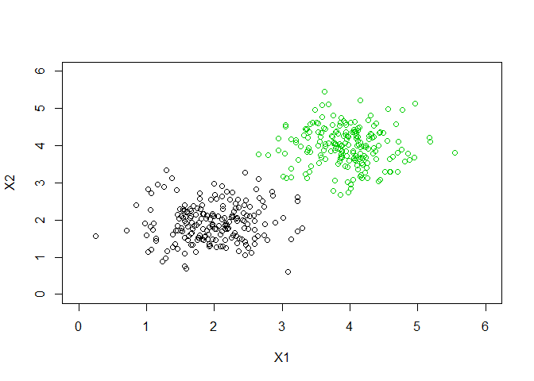
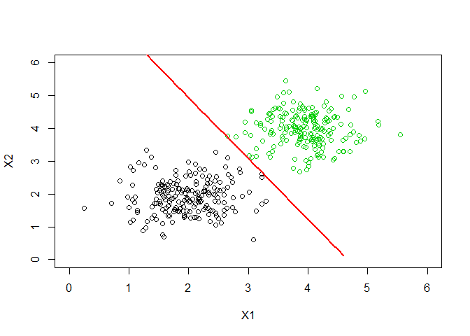

Introduction
------------

The perceptron is the simplest neural network for classification of linear patterns and its ideas were first introducted by Rosemblatt, that was inspired by Hebb`s theory and the MCP proposed by McCulloch and Pitts. The Perceptron is a single neuron with weights and a bias.


Experiment
----------

This is an implementation of a simple Perceptron for classification problems. It was developed in R. 
First we will consider a simple synthetic dataset that was generated by a random normal distribution function.

That was create two samples of different means and standard deviation. Each of this groups were assigned a class label, -1 and 1.
``` r
#Parameters of the normal distribuitons
m1 <- 2
sd1 <- 0.5
m2 <- 4
sd2<- 0.5
n <- 200

data1 <-matrix(rnorm(2*n,mean = m1,sd=sd1),ncol = 2)
data2 <-matrix(rnorm(2*n,mean = m2,sd=sd2),ncol = 2)
#Set this as class -1
data1 <- as.data.frame(data1)
data1[,3]<- -1
#And a class 1
data2 <- as.data.frame(data2)
data2[,3]<- 1

data <- rbind(data1,data2)
names(data)<-c("X1","X2","Class")
#Plot of data
plot(data$X1,data$X2,col=data$Class+2, xlab = "X1",ylab= "X2",xlim=c(0,6),ylim = c(0,6))
```



After ploting the data, we will split it into a test and train sets, so that in a future, we will be able to test the model created. It was chosen, 70% for training and 30% for testing.  

``` r
#Separate the data into Test and Training sets
ptgm <- 0.3
num_amostras <- round(ptgm*(2*n))

var_amostras<- sample(nrow(data))[1:num_amostras]
x_test <- data[var_amostras,c(1,2)]
x_train <- data[-var_amostras,c(1,2)]

y_test <- data[var_amostras,3]
y_train <- data[-var_amostras,3]
```

Next, the Perceptron`s code. It was used a sign function as a activation function.

``` r
#Perceptron
trainPerceptron <-function(x,y, eta,maxepoch){
    
    #Activation Function
    signFun <- function(z){
        
        if(z<0){
            yhat<- -1
        }else{
            yhat<- 1
        }
        
        return(yhat)
    }
    
    #Create a randon perceptron Weights
    #Number of inputs + a bias
    weight<-runif(dim(x)[2]+1,-0.5, 0.5)
 
    nepochs<-0
    evec<-vector()
    
    #Start the iteration Loop
    while((nepochs < maxepoch)){
    
        print(paste("Epoch: ",nepochs, " / ", maxepoch))   
        
        erro <- 0
        
        for(i in 1:length(y)){
            
            z<- sum(weight[2:length(weight)]* as.numeric(x[i,])) + weight[1]
            
            #Activation Function
            yhat<- signFun(z)
            
            #Erro
            e <- y[i] - yhat
            
            #Updating the weights
            dW<- eta*e*c(1,as.numeric(x[i, ]))
            weight<-weight+dW
            
            #Saving the error 
            erro <- erro + e
        }
        
        nepochs<-nepochs+1
        evec[nepochs]<-erro/nrow(x)
    }
    
    list(w = weight, erro = evec)
}
```

Considering that is a linear classifier it was used a simple function as above to plot it:

``` r
decisionBoundary<- function(ws){
    #Function to return x and y of the Decision boundary of a perceptron
    #considering its weights, WS Vetor
    
    x <- -ws[1]/ws[2]
    y <- -ws[1]/ws[3]
    
    d<-y
    c<--y/x
    
    line_x <- seq(0,x,by=0.1)
    line_y<-c*line_x+d
    return(matrix(c(line_x,line_y),ncol=2))
    
    
}
```

So lets train the perceptron calling the functions:

``` r
model<-trainPerceptron(x_train,y_train,0.1,100)

plot(data$X1,data$X2,col=data$Class+2, xlab = "X1",ylab= "X2",xlim=c(0,6),ylim = c(0,6))

par(new=TRUE)
xy_dB<-decisionBoundary(model$w)
lines(xy_dB[,1],xy_dB[,2],lwd = 2,col="red")
```



References
----------
